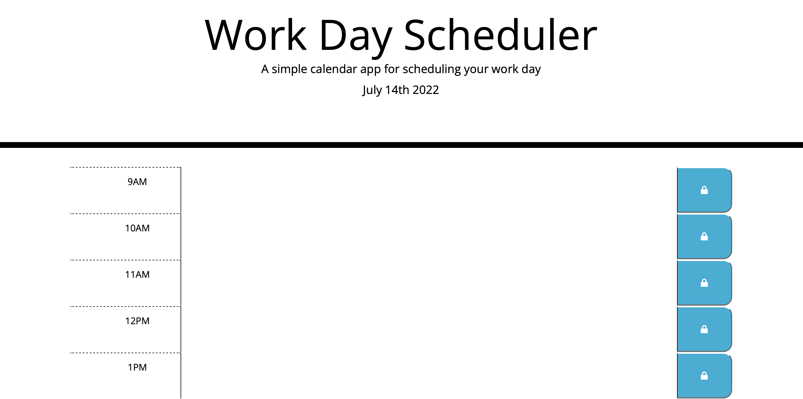

# Work Day Scheduler Starter Code
For this project, I attempted to make a functional scheduler for a typical work day that would allow someone to input tasks and see what the current one is based on the time. 

Here is a link to the github repo: https://github.com/nbacchus/nb-schedule
Here is a link to the deployed app: https://nbacchus.github.io/nb-schedule/

